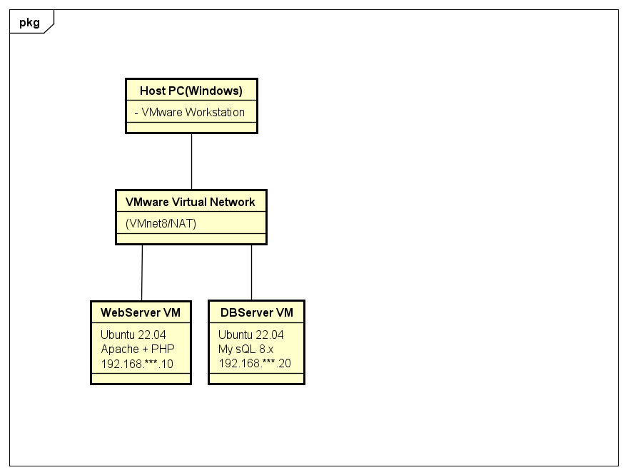

# インフラ系ポートフォリオ

##  プロジェクト概要
専門学校で学習した内容を活かして、
仮想環境のサーバー構築やネットワーク演習を実施しました。

---

## プロジェクト1: VMware上のWeb+DB構築
- **環境**: Ubuntu Server 22.04, Apache, PHP, MySQL
- **目的**: WebサーバーとDBサーバーの連携を実現
- **ポイント**:
- NATネットワーク上に２台構築
- PHPフォームからMySQLにデータを保存
- セキュリティ設定(ユーザー権限、bind-address制御)
## 構成図

## スクリーンショット

